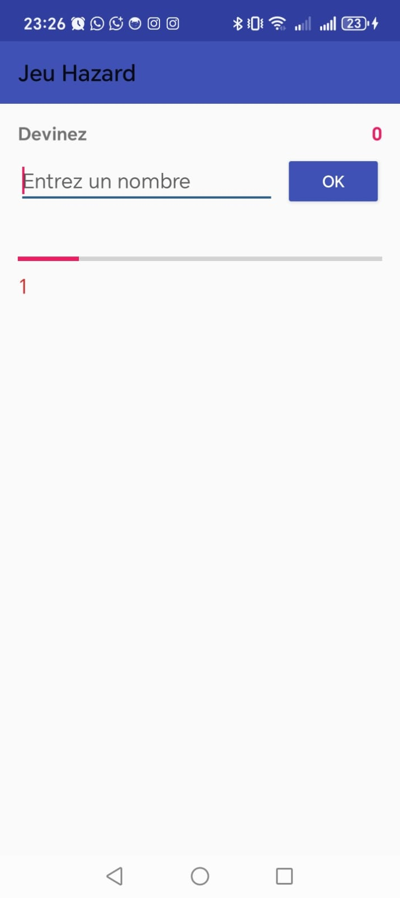
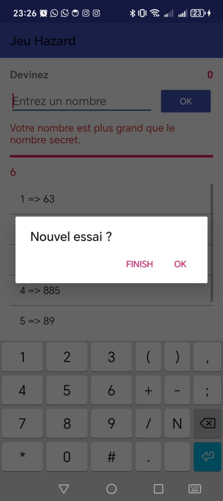
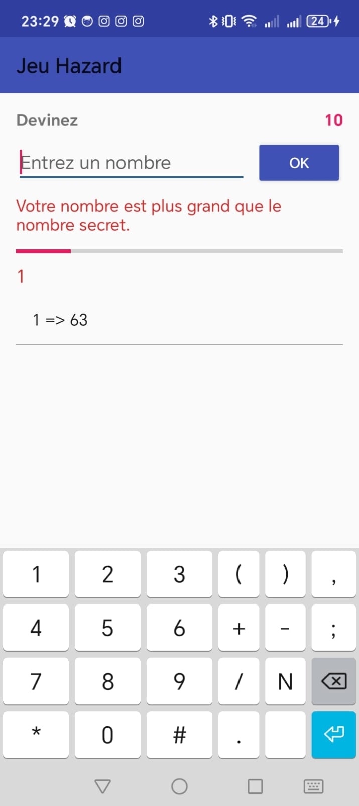
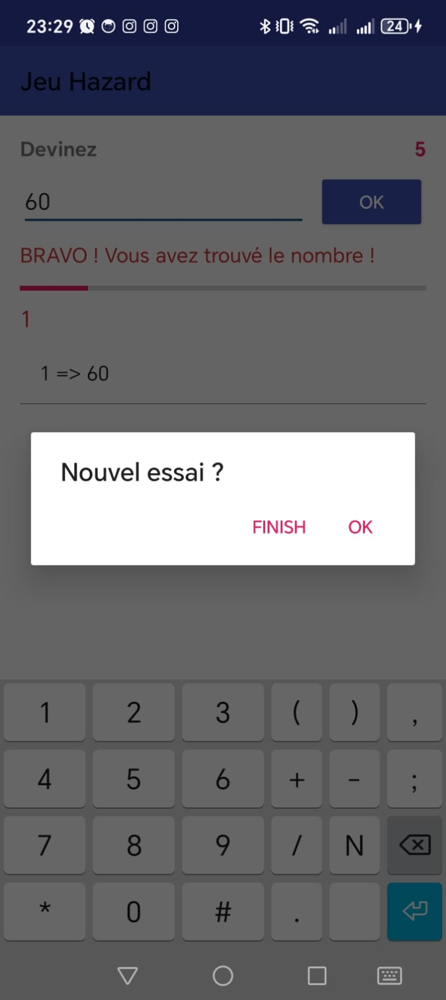

# 🎯 Jeu Hazard – Application Android

> Un jeu simple de devinettes multilingue (Français, Anglais, Arabe), où l'utilisateur tente de trouver un nombre secret entre 1 et 100.

---

## 📱 Fonctionnalités

- Génération aléatoire d’un nombre secret de 1 à 100
- Feedback visuel :
    - ✅ "BRAVO ! Vous avez trouvé le nombre !"
    - 🔺 "Votre nombre est plus grand que le nombre secret."
    - 🔻 "Votre nombre est plus petit que le nombre secret."
- Progression des essais via une **ProgressBar**
- Affichage de l’historique de tentatives dans une `ListView`
- Score cumulé visible en haut à droite
- Boîte de dialogue personnalisée : "Nouvel essai ?"
- Support multilingue : 🇫🇷 🇬🇧 🇲🇦
- Interface responsive & moderne

---

## 🧑‍💻 Développé avec

- **Kotlin**
- Interface en **XML (AppCompat)**
- Android SDK 35
- `AppCompat`, `ConstraintLayout`, `Toast`, `AlertDialog`

---

## 🖼️ Aperçu de l’application

### 🎮 Interface principale
 

### ✅ Succès et popup
 

### 🔻 Erreur + progression
 

---

## 🚀 Lancer le projet

1. Cloner le projet :
   ```bash
   git clone https://github.com/LAMBARAA-Abdellah/JeuHazard.git
